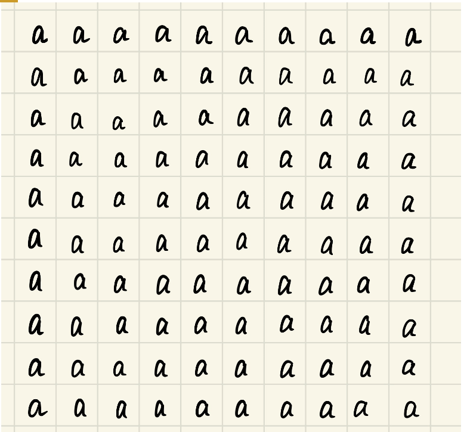
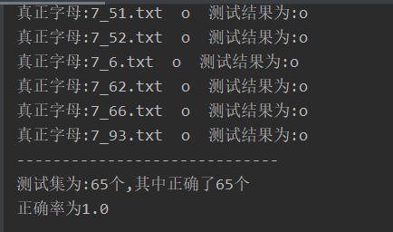

# handwrite_pinyin_rec
手写拼音识别
# 前言
因项目组需要使用到拼写识别,考虑到每个字母的复杂度不高,所以使用KNN算法来尝试实现

# 算法构造
## 1.简单介绍一下knn算法

> KNN算法，也叫K最近邻算法。功能是分类。算法逻辑非常简单，说直白点就是：先找到跟你最近的k个邻居(假设k=5)，再看你的邻居给哪个类别投票(即邻居的标签)，少数服从多数，得票最多的结果就是你的类别。

在这个算法中最关键的三点：

**k值** ：选择距离最近的k个邻居。
**距离计算**：计算距离的方法有欧式距离和曼哈顿距离，本文采用欧式距离，即先求差值的平方和，再开根号。
**分类标签**：本文的分类标签即a,b,c,d等字母

## 2.Python实现KNN

    '''
    k:k值
    testdata:测试数据集
    traindata:训练数据集
    labels:分类标签
    '''
    
    def knn(k, testdata, traindata, labels):
        '''定义算法'''
        traindatasize = traindata.shape[0] #计算训练集的长度
        dif = tile(testdata,(traindatasize,1)) - traindata #将测试集扩展至训练集的长度，再求差值
        sqrdif = dif**2 #求差值的平方
        sumsqrdif = sqrdif.sum(axis=1) #求平方和
        distance = sumsqrdif**0.5 #再开根号，即所有的距离
        sorted_distance = distance.argsort() #对距离进行排序，返回排序后的索引
        count = {} #准备一个空字典，存放投票结果
        for i in range(0,k):  
            vote = labels[sorted_distance[i]] #提取索引多对应的标签值作为字典的key
            count[vote] = count.get(vote,0)+1  #票数作为字典的value
        sorted_count = sorted(count.items(),key=lambda x:x[1],reverse=True) #对最后的投票结果进行排序
        return sorted_count[0][0] #返回得票最多的标签
        
# 二、准备数据
我~~陈悦~~用最笨的方法，花了一些时间，手写了一批png格式的数字图片：

ps:此处感谢**陈悦**同学的辛苦付出.

图片的尺寸都是统一的：32*32像素
图片的命名也是统一的：数字标签+"_"+第n张图+“.png"

## 2、将图片转换成数组矩阵

训练数据集与测试数据集都是标准化后的数组矩阵，而我们的试验对象是手写体数字图片，首先需要将图片进行一下数据化处理。

    def img2Model(originDataPath, modelpath):
        list = os.listdir(originDataPath)
        for child in list:
            s_list = os.listdir(originDataPath + child)
            for i in s_list:
    
                filepath=originDataPath + child + '/' + i
                # print(filepath)
                img = cv2.imdecode(np.fromfile(filepath, dtype=np.uint8),0)
                img = cv2.resize(img, (32, 32))
                img = np.asarray(img)
                img[img > 127] = 255
                img[img <= 127] = 1
                img[img == 255] = 0
                dstFileName = modelPath + i.split('.')[0] + '.txt'
                np.savetxt(dstFileName, img, fmt='%d', delimiter=' ')

# 三、处理数据：训练集与测试集
## 1、区分训练集和测试集

    # 随机分拣出测试集，其他文件为训练集
    def shutildata(modelpath, trainpath, testpath):
        txtlist = os.listdir(modelpath)
        index = [random.randint(0, len(txtlist)) for i in range(10)]
        # print(index)
        arr = [txtlist[i].split('.')[0].split("_")[1] for i in index]
        for i in txtlist:
            try:
                if i.split(".")[0].split("_")[1] in arr:
                    shutil.copy(modelpath + "/" + i, testpath)
                else:
                    shutil.copy(modelpath + "/" + i, trainpath)
            except:
                pass
                

## 2、加载数据
    # 加载数据

    def load_data(dataFilePath):
        arr = np.loadtxt(dataFilePath, dtype=np.int)
        arr = arr.flatten()
        return arr
        
## 3、建立训练数据

    # 建立训练数据集
    def makeTrainData(trainpath):
        labels = []
        trainfile = os.listdir(trainpath)
    
        trainarr = np.zeros((len(trainfile), 1024))
        for i in range(0, len(trainfile)):
            # print(trainfile[i])
            thislabel = trainfile[i].split(".")[0].split("_")[0]
    
            if len(thislabel) != 0:
                labels.append(int(thislabel))
            trainarr[i, :] = load_data(trainpath + trainfile[i])
        return trainarr, labels

# 四、测试数据

    # 验证
    def validate(testpath, trainpath, k):
        trainarr, labels = makeTrainData(trainpath)
        testfiles = os.listdir(testpath)
        count = 0
    
        # 读取字典表
        with open('num_char.json', 'r') as f:
            dict = json.loads(f.read())
            # print(dict)
    
        for i in range(0, len(testfiles)):
            testpicname = testfiles[i].split("_")[0]
            testarr = load_data(testpath + testfiles[i])
            result = knn(k, testarr, trainarr, labels)
    
            testpicname = dict[str(testpicname)]
            result = dict[str(result)]
    
            print("真正字母:"+testfiles[i] +"  " + testpicname + "  " + "测试结果为:{}".format(result))
            if str(testpicname) == str(result):
                count += 1
        print("-----------------------------")
        print("测试集为:{}个,其中正确了{}个".format(len(testfiles),count))
        print("正确率为{}".format(count / len(testfiles)))
        print()

